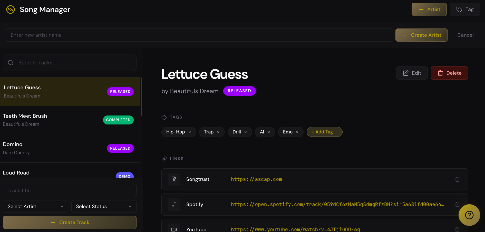

# atrakk

# aTrakk

A full-stack track management system for music artists to organize songs, demos, and releases in one place.



## What It Does

aTrakk helps artists keep track of their entire catalog—from rough ideas to released tracks. Filter by status, search by title, tag by genre, and store all your important links (Spotify, YouTube, Drive, etc.) in one spot.

## Features

- **Track Library** - View all your songs in a searchable, filterable list
- **Status Workflow** - Mark tracks as Idea → Demo → In Progress → Completed → Released
- **Genre Tags** - Categorize by Hip-Hop, EDM, Pop, Country, and more
- **Link Storage** - Attach Spotify, YouTube, Drive, or any URL to each track
- **Quick Search** - Find any track instantly by title
- **Artist Filtering** - Manage multiple artist projects from one dashboard
- **Built-in Help** - Modal guide explains exactly how to use the app

## Tech Stack

| Frontend     | Backend       |
| ------------ | ------------- |
| React        | Flask         |
| React Router | SQLAlchemy    |
| Context API  | Flask-RESTful |
| CSS          | SQLite        |

## Live Demo

**[→ View Live Demo](https://josdic1.github.io/atrakk-demo/)**

## Run Locally

```bash
# Backend
cd backend
python -m venv venv
source venv/bin/activate
pip install -r requirements.txt
python run.py

# Frontend (new terminal)
cd frontend
npm install
npm run dev
```

Backend: `http://localhost:5555`  
Frontend: `http://localhost:5173`

## About

Built as a tool for managing my own music projects under [Dare County](https://open.spotify.com/artist/3x6K65pMW3Ei35TXKC03rL). Designed to be simple and fast—no account needed, just open and use.
